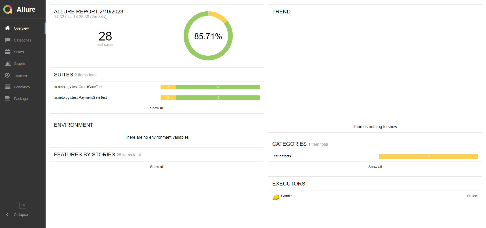

# Отчётные документы по итогам тестирования

## Краткое описание
По результатам проведенной работы по дипломному проекту была проведена автоматизация тестовых сценариев сервиса "Путешествие дня"

1. Тесты на пустые поля формы заявки
2. Тесты на заполнение полей формы заявки используя классы эквивалентности
3. Тесты на получения статуса заявки в базе данных
4. Тесты на получение ответов сервера

Были обнаружены следующие дефекты:
1. [Ошибочный алерт при проведении операции через "Купить"](https://github.com/kirillgureev/Diplom/issues/1)
2. [Нет алерта об ошибке через "Купить в кредит" при некорректном заполнении поля "CVC/CVV"](https://github.com/kirillgureev/Diplom/issues/2)
3. [Нет алерта об ошибке через "Купить" при некорректном заполнении поля "CVC/CVV"](https://github.com/kirillgureev/Diplom/issues/3)
4. [Успешная операция через "Купить в кредит" по невалидной карте](https://github.com/kirillgureev/Diplom/issues/4)
5. [Успешная операция через "Купить" по невалидной карте](https://github.com/kirillgureev/Diplom/issues/5)
6. [Ошибочный алерт при проведении операции через "Купить в кредит"](https://github.com/kirillgureev/Diplom/issues/6)

## Количество тест-кейсов

Протестировано 28 тест-кейсов

## Процент успешных и не успешных тест-кейсов

- успешных: 24
- неуспешных: 4

## Общие рекомендации

- Составить подробные требования
- Устранить найденные дефекты